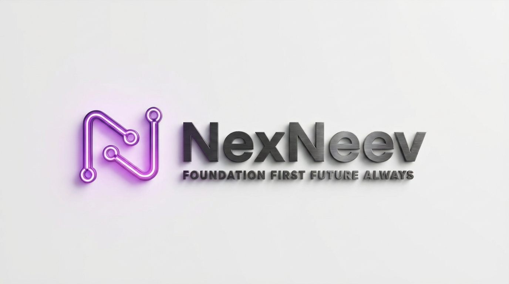
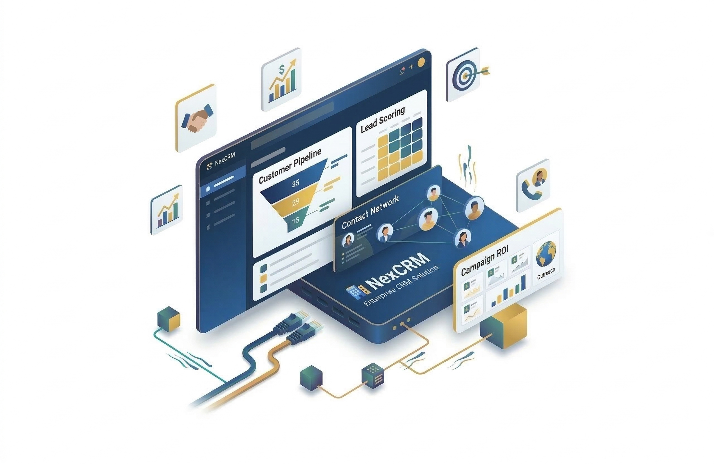
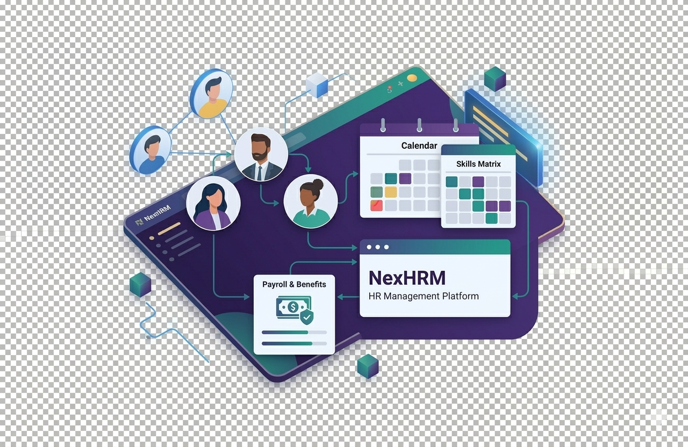

<!-- NexNeev Infotech GitHub Profile README -->
<!-- Modern Design with Company Focus -->
<h1 align="center">Nexneev Infotech</h1>

Building Mobile Apps • Web Applications • Websites • Digital Products

<!-- ====================================================================== -->
<!-- ABOUT US SECTION WITH MODERN CARD DESIGN -->
<!-- ====================================================================== -->

  <h2>
    
    About NexNeev Infotech
  </h2>

<table align="center" border="0" cellpadding="20" cellspacing="0">
  <tr>
    <td width="60%" valign="top">
      <h3>🚀 We Build Digital Excellence</h3>
      
<b>NexNeev Infotech</b> is a premier software development company dedicated to creating <b>innovative solutions</b> that empower businesses and delight users. We specialize in:

      <ul>
        <li>📱 <b>Mobile Native Apps</b> - iOS (Swift) & Android (Kotlin, Java)</li>
        <li>🔄 <b>Cross-Platform Apps</b> - Flutter, React Native, Capacitor</li>
        <li>💻 <b>Web Applications</b> - React JS, Next JS</li>
        <li>🌐 <b>Websites</b> - Corporate, E-commerce, Portfolio</li>
        <li>⚙️ <b>Backend</b> - APIs, Microservices</li>
        <li>☁️ <b>Cloud</b> - Infrastructure, DevOps</li>
        <li>🔥 <b>BAAS</b> - Firebase</li>
        <li>🏢 <b>Company Products</b> - In-house innovative solutions</li>
      </ul>
      
⭐ <b>Our Mission:</b> Transform ideas into powerful, scalable, and user-friendly digital experiences.

    </td>
    <td width="40%" align="center">
      <!-- Stats Card -->
      
       
      
    </td>
  </tr>
</table>

<!-- ====================================================================== -->
<!-- SERVICES SECTION WITH ICONS -->
<!-- ====================================================================== -->

  <h2>
    
    Our Core Services
  </h2>

  <table>
    <tr>
      <td align="center" width="200">
         
        <b>📱 Native Mobile</b> 
        iOS (Swift) & Android (Kotlin, Java)
      </td>
      <td align="center" width="200">
         
        <b>🔄 Cross-Platform</b> 
        Flutter, React Native 
        ⚡ Capacitor
      </td>
      <td align="center" width="200">
         
        <b>💻 Web Apps</b> 
        React JS, Next JS
      </td>
    </tr>
    <tr>
      <td align="center" width="200">
         
        <b>🌐 Websites</b> 
        Corporate, E-commerce
      </td>
      <td align="center" width="200">
         
        <b>⚙️ Backend</b> 
        APIs, Microservices
      </td>
      <td align="center" width="200">
         
        <b>☁️ Cloud & BAAS</b> 
        AWS, Azure, GCP, Firebase
      </td>
    </tr>
  </table>

<!-- ====================================================================== -->
<!-- COMPANY PRODUCTS SHOWCASE -->
<!-- ====================================================================== -->

  <h2>
    
    Our Flagship Products
  </h2>

  <table>
    <tr>
      <td width="33%" align="center">
         
        <b>🏢 NexCRM</b> 
        Enterprise CRM Solution
      </td>
      <td width="33%" align="center">
         
        <b>🕒 NexAttendance</b> 
        Smart Attendance Management System
      </td>
      <td width="33%" align="center">
         
        <b>👥 NexHRM</b> 
        HR Management Platform
      </td>
    </tr>
  </table>
  
<i>✨ More innovative products in development ✨</i>

<!-- ====================================================================== -->
<!-- TECHNOLOGY STACK WITH BADGES -->
<!-- ====================================================================== -->

  <h2>
    
    Our Technology Arsenal
  </h2>

  
  ### 📱 Mobile App Development
  
  
  
  
  
  
  
  ### 💻 Web Development
  
  
  
  
  
  
  ### ⚙️ Backend & APIs
  
  
  
  
  ### ☁️ Cloud & BAAS
  
  
  
  
  
  ### 🔧 DevOps & Infrastructure
  
  
  
  ### 🗄️ Databases
  
  
  

<!-- ====================================================================== -->
<!-- WHY CHOOSE US SECTION -->
<!-- ====================================================================== -->

  <h2>
    
    Why Partner With NexNeev?
  </h2>

  <table>
    <tr>
      <td align="center" width="250">
        <h3>🎯 100+</h3>
        
Projects Delivered

      </td>
      <td align="center" width="250">
        <h3>😊 50+</h3>
        
Happy Clients

      </td>
      <td align="center" width="250">
        <h3>⚡ 24/7</h3>
        
Support Available

      </td>
    </tr>
  </table>

<!-- ====================================================================== -->
<!-- CONNECT WITH US SECTION -->
<!-- ====================================================================== -->

  <h2>
    
    Let's Build Something Amazing Together
  </h2>

  
   
  
   
  
   
  
   
  

<!-- ====================================================================== -->
<!-- FOOTER WITH ANIMATION -->
<!-- ====================================================================== -->

   
  
   
  
   
  © 2024 NexNeev Infotech. All rights reserved. Made with ❤️ for innovation

